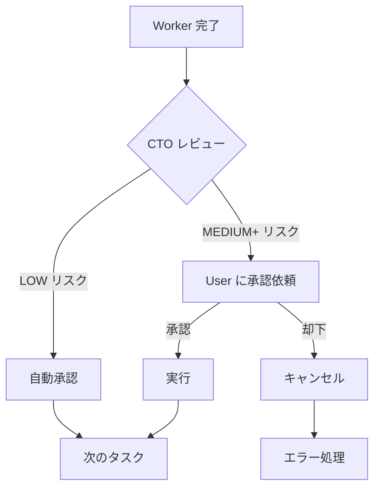

# CTO アーキテクチャ - Chief Technology Officer による管理体制

## 🎯 概要

MAOの新しい組織構造は、**User → CTO → Workers** の3層シンプル構成です。

```
👤 User (Approver)
    ↓ 重要な判断のみエスカレーション
👔 CTO (Monitor & Decider)
    ↓ タスク分配・監視・判断
🔧 Workers × 8 (Executors)
```

### 従来との比較

| 項目 | 従来（5層） | 新CTO構成（3層） |
|------|------------|-----------------|
| 階層数 | 5層 | 3層 |
| 意思決定速度 | 遅い | 速い |
| ユーザー負担 | 高い | 低い（重要な判断のみ） |
| 役割の明確さ | 複雑 | シンプル |
| 実装の複雑さ | 高い | 中程度 |

## 🏗️ CTOの役割

###

 1. タスク分解 (Task Decomposition)

ユーザーからの依頼を実行可能なサブタスクに分解：

```
【入力】
"認証システムを実装して"

【CTO の分解結果】
1. ログイン画面のUI実装 → worker-1
2. 認証APIエンドポイント → worker-2
3. セッション管理機能 → worker-3
4. テストコード作成 → worker-4
```

### 2. 監視 (Monitoring)

ワーカーの進捗状況をリアルタイム監視：

- タスクキューから完了結果を取得
- エラー検出と再試行
- タイムアウト管理
- 依存関係の管理

### 3. レビューと判断 (Review & Decision)

各ワーカーの成果物をレビューし、リスク評価：

#### 自動承認 (LOW リスク):
- テストコード追加
- ドキュメント更新
- バグフィックス（小規模）
- コードのリファクタリング

#### エスカレーション (MEDIUM ~ CRITICAL リスク):
- ファイル削除
- 外部API呼び出し
- データベース変更
- 設定ファイル変更
- 依存パッケージ追加

### 4. 承認フロー (Approval Flow)



## 📋 ファイル構成

### 新規作成ファイル

| ファイル | 説明 |
|---------|------|
| `mao/roles/cto.yaml` | CTOロール定義 |
| `mao/orchestrator/cto_decision.py` | 判断エンジン |
| `mao/orchestrator/cto_orchestrator.py` | CTO監視ループ |
| `mao/ui/widgets/approval_request.py` | 承認UI |
| `docs/CTO_ARCHITECTURE.md` | 本ドキュメント |

### 変更されたファイル

| ファイル | 変更内容 |
|---------|---------|
| `mao/ui/dashboard_interactive.py` | 承認キュー追加、CTO対応 |
| `mao/ui/widgets/__init__.py` | 承認ウィジェットexport |

## 🎨 ダッシュボードUI

```
┌─────────────────────────────────────────────┐
│ 👔 CTO Chat - CTOとの対話                   │
│                                             │
│ User: 認証システムを実装して                 │
│ CTO:  了解しました。以下に分解します:        │
│       1. ログイン画面 → worker-1            │
│       2. 認証API → worker-2                 │
│       3. セッション管理 → worker-3          │
│       4. テスト → worker-4                  │
│                                             │
│ [タスク割り当て完了]                         │
└─────────────────────────────────────────────┘

┌─────────────────────────────────────────────┐
│ 📊 Metrics - 統計・使用量                    │
│ Active: 4/8  Tokens: 15,234  Cost: $0.45   │
└─────────────────────────────────────────────┘

┌─────────────────────────────────────────────┐
│ 🔔 Approval Queue - 承認待ち                │
│                                             │
│ ⚠️ 承認リクエスト [MEDIUM]                  │
│ ワーカー: worker-2                          │
│ 操作: 外部API呼び出し                       │
│ タスク: 認証APIエンドポイント実装           │
│                                             │
│ 【理由】                                    │
│ 外部API呼び出しが含まれています             │
│                                             │
│ 【推奨】                                    │
│ APIキーの管理を確認してから承認してください │
│                                             │
│ [✅ 承認] [❌ 却下] [📋 詳細を確認]        │
└─────────────────────────────────────────────┘

┌─────────────────────────────────────────────┐
│ 👥 Workers - ワーカー一覧                    │
│                                             │
│ ⚙ worker-1  Completed  ✅ Auto-approved    │
│ ⚙ worker-2  Waiting    ⏳ Pending approval │
│ ⚙ worker-3  Running...                     │
│ ⚙ worker-4  Waiting                        │
└─────────────────────────────────────────────┘

┌─────────────────────────────────────────────┐
│ 📝 Logs - 実行ログ                          │
│                                             │
│ 12:34:56 | INFO | [CTO] タスク分解完了      │
│ 12:35:12 | INFO | [worker-1] タスク開始     │
│ 12:35:45 | INFO | [CTO] worker-1 自動承認   │
│ 12:36:22 | WARN | [CTO] worker-2 承認待ち   │
└─────────────────────────────────────────────┘
```

## 🔧 使用方法

### 1. インタラクティブモードで起動

```bash
mao start --interactive "認証システムを実装"
```

### 2. CTOとチャット

```
CTOチャットに入力:
「認証システムを実装してください。
 ログイン、ログアウト、パスワードリセット機能が必要です」
```

### 3. CTOがタスク分解

```
CTO応答:
了解しました。以下のようにタスクを分解して実行します:

1. ログイン画面UI実装 (worker-1) [LOW]
2. ログアウトボタン追加 (worker-2) [LOW]
3. 認証APIエンドポイント (worker-3) [MEDIUM]
4. パスワードリセット機能 (worker-4) [HIGH]
5. テストコード作成 (worker-5) [LOW]

リスク評価:
- worker-1, 2, 5: 自動承認可能
- worker-3: 外部API使用のため要承認
- worker-4: メール送信のため要承認

タスクを割り当てますか？
```

### 4. 承認フロー

#### 自動承認されるケース

```
[CTO Activity Log]
12:35:45 | worker-1 完了
12:35:46 | レビュー: リスクLOW
12:35:46 | ✅ 自動承認
         | 理由: UIコードの追加は安全
```

#### 承認が必要なケース

```
[Approval Queue に表示]

⚠️ 承認リクエスト [MEDIUM]

ワーカー: worker-3
操作: 外部API呼び出し (auth0.com)
タスク: 認証APIエンドポイント実装

【理由】
外部API呼び出しを検出しました: 外部API

【推奨】
内容を確認してから承認してください。

【詳細】
以下のコードを実装しました:
```python
import requests

def authenticate(username, password):
    response = requests.post(
        "https://auth0.com/oauth/token",
        json={"username": username, "password": password}
    )
    return response.json()
```

[✅ 承認] [❌ 却下] [📋 詳細を確認]
```

### 5. ユーザーが承認/却下

**承認した場合:**
```
✅ リクエスト req-abc123 を承認しました

[CTO Activity Log]
12:36:30 | worker-3 User承認
12:36:30 | タスク完了
```

**却下した場合:**
```
❌ リクエスト req-abc123 を却下しました

[CTO Activity Log]
12:36:30 | worker-3 User却下
12:36:30 | タスクキャンセル
12:36:31 | worker-3 に修正を指示
```

## 💡 判断ロジック

### リスク評価基準

#### ファイルパターン

| パターン | リスクレベル |
|---------|------------|
| `.env`, `secrets.yaml` | CRITICAL |
| `config/*.yml`, `*.sql` | HIGH |
| `package.json`, `requirements.txt` | MEDIUM |
| `*_test.py`, `*.md` | LOW |

#### キーワード

| キーワード | リスクレベル |
|-----------|------------|
| delete, remove, rm | HIGH |
| SQL, migration, database | HIGH |
| API, http, external | MEDIUM |
| npm install, pip install | MEDIUM |
| test, doc, comment | LOW |

#### 変更量

| 行数 | リスクレベル |
|-----|------------|
| 500+ | HIGH |
| 100-499 | MEDIUM |
| <100 | LOW |

### 総合判断

最もリスクが高い要素に基づいて判断：

```python
overall_risk = max(
    file_pattern_risk,
    keyword_risk,
    change_size_risk
)

if overall_risk >= MEDIUM:
    action = ESCALATE  # ユーザー承認
else:
    action = APPROVE   # 自動承認
```

## 🔐 セキュリティ

### 承認が必要な操作

1. **ファイルシステム操作**
   - ファイル削除
   - 設定ファイル変更
   - `.env` 変更

2. **外部通信**
   - HTTP/HTTPS リクエスト
   - 外部API呼び出し
   - Webhook設定

3. **データベース**
   - スキーマ変更
   - マイグレーション実行
   - データ削除

4. **依存関係**
   - パッケージ追加
   - バージョン変更

5. **実行権限**
   - シェルコマンド実行
   - Docker操作
   - システム設定変更

## 📊 実行フロー全体像

```
1. User がCTOに依頼
   ↓
2. CTOがタスク分解
   ├─ worker-1: UI実装
   ├─ worker-2: API実装
   ├─ worker-3: テスト
   └─ worker-4: ドキュメント
   ↓
3. タスクキューに割り当て
   .mao/queue/tasks/worker-1.yaml
   .mao/queue/tasks/worker-2.yaml
   ...
   ↓
4. Workerループがタスク実行
   (tmuxペイン内でclaude-code実行)
   ↓
5. 結果をキューに送信
   .mao/queue/results/worker-1.yaml
   .mao/queue/results/worker-2.yaml
   ...
   ↓
6. CTOが監視ループで結果を取得
   ↓
7. 各結果をレビュー
   ├─ リスク評価
   ├─ コード品質チェック
   └─ セキュリティチェック
   ↓
8. 判断
   ├─ LOW → 自動承認
   └─ MEDIUM+ → User承認依頼
       ↓
       User が承認/却下
   ↓
9. 全タスク完了
   ↓
10. CTOがサマリーをUserに報告
```

## 🚀 次のステップ

### 現在実装済み

- ✅ CTOロール定義
- ✅ 判断エンジン
- ✅ 承認UIウィジェット
- ✅ ダッシュボード統合
- ✅ CTO監視ループ

### 今後の拡張

- ⏳ CTOとダッシュボードの完全統合
- ⏳ ワーカーループの自動起動
- ⏳ タスク依存関係の管理
- ⏳ 承認履歴の永続化
- ⏳ CTOの学習機能（過去の承認パターン）

## 📝 設定

### cto.yaml での設定

```yaml
monitoring_config:
  poll_interval: 2.0    # 監視間隔（秒）
  timeout: 600          # タイムアウト（秒）
  max_retries: 2        # 最大再試行回数

quality_thresholds:
  min_test_coverage: 0.7   # 最低テストカバレッジ
  max_complexity: 10       # 最大循環的複雑度
  max_function_length: 50  # 関数の最大行数
```

## 🎓 ベストプラクティス

### CTOへの依頼

**Good:**
```
「ユーザー認証システムを実装してください。
 ログイン、ログアウト、パスワードリセット機能が必要です。
 セキュリティには特に注意してください。」
```

**Bad:**
```
「認証やって」  # 曖昧すぎる
```

### 承認判断

**承認すべき:**
- テストが十分
- セキュリティリスクが低い
- 変更範囲が明確

**却下すべき:**
- テスト不足
- セキュリティ懸念あり
- 変更範囲が不明確
- 説明が不十分

## 🔗 関連ドキュメント

- [Tmux アーキテクチャ](./TMUX_ARCHITECTURE.md)
- [タスクキュー](./TASK_QUEUE.md)
- [Git Worktree 分離](./WORKTREE_ISOLATION.md)
- [インタラクティブモード](./INTERACTIVE_MODE.md)
